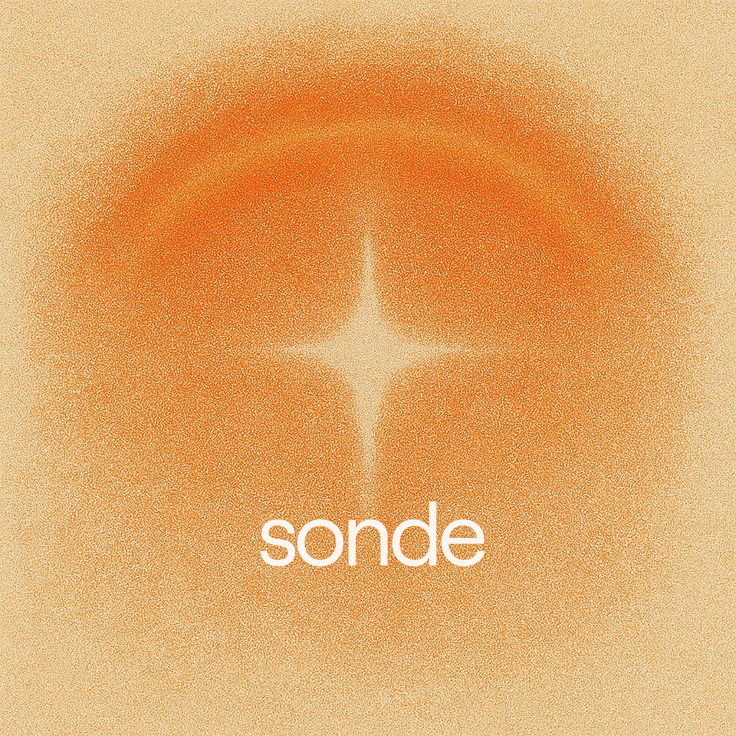

  

# Sonde

Experimental workspace for exploring **open-source numerical weather / atmosphere modeling** codebases and **automatic research-agent** stacks, with the long-term goal of tooling that sits on top of our **NWP** workflows: literature-to-code mapping, experiment orchestration, parameter search, and reproducible runs tied to model APIs.

**Authoritative guidance for humans and coding agents:** see **[AGENTS.md](./AGENTS.md)** (goals, folder conventions, what to extract from each upstream repo, Breeze.jl reference, success criteria for NWP code).

**Canonical deep dives:** each mirror has a dedicated **`notes/<name>/README.md`** with pins, tools, coordination, domain, and comparison hooks. The sections below **mirror that content** so the repo root stays navigable; if anything conflicts, **trust the note file**.

---

## Repository layout

| Path | Role |
|------|------|
| **`assets/`** | Static images and other repo-owned media (e.g. README header). |
| **`vendor/`** | Shallow clones of upstream repos (often **science / NWP**). Read-mostly; pin commits in notes or experiments. |
| **`repos/`** | Same idea for **agent frameworks**, **research pipelines**, and other **non-core-NWP** mirrors. Read-mostly. |
| **`notes/`** | **Primary analysis** — tools, coordination patterns, domain summary, commit pins, comparison hooks. |
| **`experiments/`** | (Optional) Small scripts or notebooks that depend on vendored or registered packages. |

When adding a new mirror, add or extend a folder under **`notes/<name>/`** instead of leaving findings only in chat.

---

## What we compare across repos

For **every** upstream we care about—not only solvers—we document:

- **Tools:** languages, frameworks, SDKs, how the system is invoked.
- **Multi-agent coordination:** roles, control flow (graphs, pipelines, debates, delegation), and what framework wires steps together (if any).
- **Domain layer:** for NWP code, how simulations are built and extended; for agent systems, what problem the pipeline solves.

Over time we compare these notes to see **where ecosystems converge** (e.g. LangGraph-heavy apps, markdown “program” skills, stage pipelines) versus where they diverge.

---

## Notes index (quick links + pins)

| Notes | Mirror | Pin (see note for full) |
|-------|--------|-------------------------|
| [notes/trading-agents](./notes/trading-agents/README.md) | `repos/TradingAgents` | `589b351…` · v0.2.2 |
| [notes/autoresearch](./notes/autoresearch/README.md) | `repos/autoresearch` | `228791fb…` |
| [notes/deepagents](./notes/deepagents/README.md) | `repos/deepagents` | `a32ce7ff…` · pkg 0.5.0a2 |
| [notes/datagen](./notes/datagen/README.md) | `repos/DATAGEN` | `31567439…` |
| [notes/ai-scientist-v2](./notes/ai-scientist-v2/README.md) | `repos/AI-Scientist-v2` | `96bd5161…` |
| [notes/autoresearch-claw](./notes/autoresearch-claw/README.md) | `repos/AutoResearchClaw` | `01c4df9f…` · researchclaw 0.3.1 |
| [notes/scienceclaw](./notes/scienceclaw/README.md) | `repos/scienceclaw` | `e53f3c14…` |
| [notes/agentic-data-scientist](./notes/agentic-data-scientist/README.md) | `repos/agentic-data-scientist` | `3ce58ef0…` · pkg 0.2.2 |
| [notes/denario](./notes/denario/README.md) | `repos/Denario` | `61e0cce5…` · pkg 1.0.1 |
| [notes/atlas-gic](./notes/atlas-gic/README.md) | `repos/atlas-gic` | `170aadbe…` |
| [notes/mirofish](./notes/mirofish/README.md) | `repos/MiroFish` | `1536a793…` · backend 0.1.0 |

**NWP (Julia):** **`vendor/Breeze.jl`** — [NumericalEarth/Breeze.jl](https://github.com/NumericalEarth/Breeze.jl). Full module map and update commands: **[AGENTS.md § Vendored reference: Breeze.jl](./AGENTS.md)**.

---

## Notes — content summary (from `notes/*/README.md`)

### [TradingAgents](./notes/trading-agents/README.md) — Tauric Research

- **What it does:** Multi-agent **LLM trading** framework: analysts → bull/bear debate → research manager → trader → risk debators → portfolio manager.
- **Tools:** Python **Typer** CLI + **Rich** + **Questionary**; **LangGraph** `StateGraph` + **ToolNode**; **LangChain** chat wrappers (OpenAI, Anthropic, Google); **yfinance**, **stockstats**, optional Alpha Vantage; **rank-bm25** lexical memory per role.
- **Coordination:** **Fixed compiled graph** — sequential analyst chains with tool loops; conditional debate/risk rounds; **two LLM tiers** (quick vs deep). **Not** free-form planner delegation.
- **Unlike NWP:** Finance data APIs + LLM reasoning, not a weather model.

### [autoresearch](./notes/autoresearch/README.md) — karpathy

- **What it does:** Minimal **GPT pretraining** harness: agent may edit only **`train.py`**; fixed **~5 min** wall-clock runs; metric **val_bpb**.
- **Tools:** **uv**, **PyTorch** (CUDA), **kernels** (Flash Attention–style), numpy/pandas/pyarrow/tiktoken/rustbpe, etc. **No** LangChain/LangGraph in-repo.
- **Coordination:** **No** in-repo agent API. Human starts **Claude/Codex/etc.**; agent follows **`program.md`**; training is **`uv run train.py`** (subprocess), not an LLM call.
- **Context:** Durable state = **`program.md`**, **`train.py`**, **git** (keep/revert), **`results.tsv`**, **`run.log`**; new IDE sessions **reconstruct** from files + git, not chat history.

### [deepagents](./notes/deepagents/README.md) — LangChain

- **What it does:** **`create_deep_agent()`** — batteries-included harness: todos, virtual FS, optional shell, **`task`** subagents, summarization, optional SKILL.md + AGENTS.md memory.
- **Tools:** **LangChain** `create_agent` + **LangGraph** `CompiledStateGraph`; middleware stack (filesystem, subagents, summarization, Anthropic prompt caching, optional HIL); backends (**StateBackend**, filesystem, sandboxes).
- **Coordination:** Main agent + **`task`** spawns **ephemeral** subagents (single return message); optional **async/remote** subagents. **LLM** decides when to delegate — not a hard-coded finance-style DAG.
- **Security:** “Trust the LLM” — enforce boundaries in **sandbox/tools**.

### [DATAGEN](./notes/datagen/README.md) — starpig1129

- **What it does:** **LangGraph** pipeline for **tabular data analysis**: hypothesis → human choice → **process supervisor** routes to code/search/viz/report → quality review → **note agent** → loop; refiner + human review at end.
- **Tools:** **LangChain** agents + **LangGraph**; **ToolFactory** (execute code, files, web, Wikipedia, arXiv); optional **MCP** (filesystem, web-search, GitHub); per-agent **`config/agents/*/config.yaml`**.
- **Coordination:** **Routers read state** (`process_decision`, `needs_revision`) — supervisor uses **structured output** to pick next node. Hybrid: **code-defined graph** + **LLM inside each node**.

### [AI-Scientist-v2](./notes/ai-scientist-v2/README.md) — Sakana AI

- **What it does:** **Ideation** (Markdown topic → JSON ideas) → **best-first tree search (BFTS)** over **LLM-written ML code** (GPU) → **AgentManager** stages → LaTeX/paper + citations + LLM/VLM review.
- **Tools:** OpenAI/Anthropic/Bedrock/Gemini; **Semantic Scholar**; PyTorch stack; **Journal** tree + **parallel_agent** workers; based on **AIDE**-style loop (see upstream ack).
- **Coordination:** **Tree search + metrics** + **staged manager** (LLM structured schemas for stage progression) — **not** a single LangGraph app; exploration-first vs template-heavy v1.

### [AutoResearchClaw](./notes/autoresearch-claw/README.md) — aiming-lab

- **What it does:** **`researchclaw` CLI** — **23-stage** pipeline (literature → hypotheses → experiment design/code/run/refine → analysis/**stage 15 decision** → paper → quality → export → **citation verify**). Deliverables under **`artifacts/rc-…/deliverables/`**.
- **Tools:** Core `pyproject` minimal; extras for web/PDF/science; **CodeAgent**, **BenchmarkAgent** (ML), **FigureAgent**; optional **OpenCode** “Beast mode”; **OpenClaw** / **MetaClaw** integration.
- **Coordination:** **Explicit state machine** with **gates**, **checkpoint/resume**, **PIVOT/REFINE** from stage 15 — productized “research CI/CD,” not BFTS-centric.

### [ScienceClaw](./notes/scienceclaw/README.md) — lamm-mit

- **What it does:** Computational **science agent** with **300+ skills**, **ToolUniverse**, **Infinite** social layer; **DeepInvestigator** + **ArtifactReactor** (needs broadcast on `global_index.jsonl`), optional **AutonomousOrchestrator** for multi-agent demos.
- **Tools:** Direct OpenAI/Anthropic SDKs (**not** LangChain core path); **skill_executor** subprocesses; **Harvard ToolUniverse** gateway.
- **Coordination:** **Artifact lineage + need fulfillment** across agents on one machine; **SessionManager** file-backed sessions; **not** a single LangGraph DAG as primary metaphor.

### [agentic-data-scientist](./notes/agentic-data-scientist/README.md) — K-Dense AI

- **What it does:** **Orchestrated** data-science workflow: **plan** → **review loop** → **parse** stages + success criteria → **stage orchestrator** (implement → **criteria checker** → **stage reflector**) → **summary**; **`--mode simple`** bypasses full pipeline for quick Claude Code tasks.
- **Tools:** **Google ADK** (`SequentialAgent`, `LoopAgent`, `LoopDetectionAgent`); **LiteLLM/OpenRouter** for planning/review (**Gemini**-class defaults); **Claude Agent SDK** + **Claude Code CLI** for implementation; read-only **file** tools + optional **`fetch_url`**; **Context7** MCP on coding path; **claude-scientific-skills** cloned to `.claude/skills/`.
- **Coordination:** **Hybrid runtime** — ADK orchestrates **Gemini-via-OpenRouter** agents; **coding** is **Claude Code** with skills. **Structured Pydantic** outputs for plan parse, criteria updates, stage reflection; **review confirmation** uses **escalate** to exit loops.
- **Validation:** LLM reviewers + **criteria `met` + evidence** in state; **loop detection** + **event compression**; not a separate formal stats layer.

### [Denario](./notes/denario/README.md) — AstroPilot-AI

- **What it does:** **Science research assistant** — data/tools description → **idea → methods → results (code) → LaTeX paper** (journal presets); optional literature check and PDF referee.
- **Tools:** **LangGraph** (`StateGraph`) for **fast** idea/methods, literature loop, referee, and **section-by-section paper DAG**; **LangChain** chat models (Gemini/OpenAI/Anthropic); **`cmbagent`** `planning_and_control_context_carryover` for **slow** idea/methods and **all** results (engineer/researcher + planner); **Semantic Scholar** API; optional **FutureHouse** Owl; **PyMuPDF**/images for referee.
- **Coordination:** **Dual backend** — user picks `mode="fast"` (LangGraph) vs `cmbagent` for idea/methods; **task router** on one graph (`idea_generation` / `methods_generation` / `literature` / `referee`); **maker↔hater** loop for ideas; **novelty → Semantic Scholar → novelty** loop; paper pipeline **linear** with optional citations node. README cites **AG2**; this tree depends on **cmbagent** directly for heavy multi-agent runs.
- **Unlike NWP:** General scientific coding + writing; astro/ML examples, not a weather model.

### [ATLAS / atlas-gic](./notes/atlas-gic/README.md) — General Intelligence Capital

- **What it does (narrative):** **25+** trading agents in **4 layers** (macro → sector → superinvestor styles → CRO / alpha / execution / CIO), **Darwinian weights**, **Karpathy-style autoresearch** on prompts (Sharpe, git keep/revert), **JANUS** meta-layer across **cohorts**, **MiroFish**-style simulated futures + **reflexivity** rules. **Open repo:** architecture markdown, example prompt shells, sample `results/`, and **partial** Python — **not** the full daily EOD runner or trained prompts.
- **Tools (stated):** **Claude** (Anthropic); market data **FMP / Finnhub / Polygon / FRED**; **git**; **MiroFish** upstream for “full” swarm (public code path defaults to **single-call Claude simulation**). **In open files:** `anthropic`, `numpy` (futures paths), stdlib; **`janus.py`** is self-contained; **`mirofish_*`** imports **`config` / `data` clients not shipped** in this tree — needs stubs or private modules to run.
- **Coordination:** **Documented** — layered JSON handoffs, parallel within layer, weighted CIO synthesis, adversarial CRO. **Implemented in OSS** — **`Janus`** cohort softmax + blend + regime label; **MiroFish bridge** = seed/scenarios → **one** `messages.create` with multi-role **simulation** JSON; **`ForwardTrainer`** = per-agent Haiku calls on synthetic scenarios. **No** LangGraph in-repo.
- **Unlike NWP:** Discretionary equity / macro; production stack mostly **documentation + IP** outside the mirror.

### [MiroFish](./notes/mirofish/README.md) — 666ghj / Shanda

- **What it does:** **Seed docs → LLM ontology → Zep standalone graph → OASIS Twitter+Reddit swarm (parallel subprocesses) → optional Zep episode updates from every agent action → ReportAgent** (outline + **ReACT** per section with Zep search tools + **live interview** of simulated agents). Vue/Vite UI + Flask API.
- **Tools:** **Flask**; **OpenAI-compatible** LLM client; **zep-cloud**; **camel-oasis** + **camel-ai**; **PyMuPDF**/text; **Docker** / npm monorepo. Docstring mentions **LangChain** for ReportAgent; **`pyproject` has no LangChain** — ReACT is **hand-rolled** + `ZepToolsService`.
- **Coordination:** **Thousands** of OASIS **social agents** (not a small fixed DAG); **dual-platform** parallel runs; **single** analyst-style ReportAgent with **tool loop**; graph is **shared memory** (seed + simulation).
- **Unlike NWP:** Social simulation / prediction sandbox, not geophysical code.

---

## Orchestration styles at a glance

| Style | Examples here |
|-------|----------------|
| **Fixed LangGraph DAG** | TradingAgents, DATAGEN |
| **Middleware + `create_agent` graph** | deepagents |
| **Markdown + external IDE loop** | karpathy autoresearch |
| **Tree search over experiments** | AI-Scientist-v2 |
| **Long explicit stage pipeline** | AutoResearchClaw |
| **Google ADK `SequentialAgent` + `LoopAgent` + custom stage orchestrator** | agentic-data-scientist |
| **Skills + artifact index / needs signals** | ScienceClaw |
| **LangGraph (tasks) + cmbagent planning/control for code-heavy steps** | Denario |
| **Documented layered finance pipeline + git autoresearch; OSS: algorithmic JANUS + Claude “swarm” simulation** | ATLAS / atlas-gic |
| **OASIS swarm (many agents) + Zep graph + custom ReACT ReportAgent** | MiroFish |
| **Library only (no agent orchestration in repo)** | Breeze.jl ([AGENTS.md](./AGENTS.md)) |

---

## External compass (agent patterns)

[Tauric Research](https://github.com/TauricResearch) (e.g. **TradingAgents**) is a **reference** for multi-agent LLM coordination in the wild—not assumed to match our NWP product stack.

---

## License

Mirrored upstream projects retain their own licenses. Content **native to this workspace** (`AGENTS.md`, `notes/`, this `README.md`) follows whatever license the team assigns to the Sonde project root when published.
